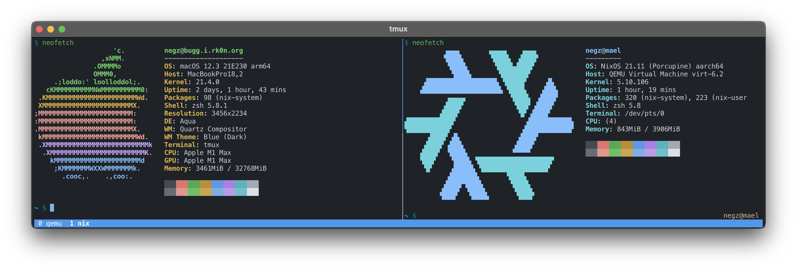

# nix

The Nix configuration for my M1 Mac. 



The goal here is to:

* Have a _somewhat_ lightweight Linux VM in which to run the Docker daemon.
* Leverage said Linux VM for not-containers things from time to time.
* Manage both the MacOS host and the Linux VM using the same, declarative tool.

I use [nix-darwin] to configure the Mac's command-line environment. I also run a
headless [NixOS] VM in QEMU. My user on both is configured using [home-manager].

To bootstrap a new M1 Mac, first install [iTerm] and load `iterm2.json`, then:

```shell
# Install the Nix package manager.
sh <(curl -L https://nixos.org/nix/install)

# Install nix-darwin
nix-build https://github.com/LnL7/nix-darwin/archive/master.tar.gz -A installer
./result/bin/darwin-installer

# Rebuild the Mac
darwin-rebuild switch --flake github:negz/nix#bugg
```

Once the Mac is boostrapped, create a VM:

```shell
# Create a disk for the VM.
FIRMWARE=$(nix eval --raw 'nixpkgs#qemu')/share/qemu/edk2-aarch64-code.fd
NIX_ROOT=$PWD/vm/nixos.qcow2
qemu-img create -f qcow2 $NIX_ROOT 80G

# Grab an install ISO from Hydra
# https://hydra.nixos.org/job/nixos/release-21.11/nixos.iso_minimal.aarch64-linux/all
NIX_INSTALL=$PWD/vm/install.iso
curl -o $NIX_INSTALL https://hydra.nixos.org/build/170436603/download/1/nixos-minimal-21.11.336635.31aa631dbc4-aarch64-linux.iso

# Start the VM. Ctrl-A-X to kill the VM.
qemu-system-aarch64 \
    -name mael \
    -machine virt,accel=hvf,highmem=off \
    -cpu host \
    -smp 4,sockets=1,cores=4,threads=1 \
    -m 4096 \
    -boot menu=on \
    -drive if=pflash,format=raw,readonly=on,file=${FIRMWARE} \
    -drive if=none,media=disk,id=drive0,cache=writethrough,file=${NIX_ROOT} \
    -drive if=none,media=cdrom,id=drive1,readonly=on,file=${NIX_INSTALL} \
    -device virtio-rng-pci \
    -device ramfb \
    -device ahci,id=achi0 \
    -device virtio-net-pci,netdev=net0 \
    -device qemu-xhci,id=usb-bus \
    -device usb-kbd,bus=usb-bus.0 \
    -device usb-mouse,bus=usb-bus.0 \
    -device virtio-blk-pci,drive=drive0,bootindex=1 \
    -device usb-storage,drive=drive1,removable=true,bus=usb-bus.0,bootindex=0 \
    -netdev user,id=net0,net=192.168.100.0/24 \
    -parallel none \
    -display none \
    -vga none \
    -serial mon:stdio

# Once the VM is running become root.
sudo -i

# Partition the disk.
parted /dev/vda -- mklabel gpt
parted /dev/vda -- mkpart primary 256MiB 100%
parted /dev/vda -- mkpart ESP fat32 1MiB 256MiB
parted /dev/vda -- set 2 esp on

# Format the disk
mkfs.ext4 -L nixos /dev/vda1
mkfs.fat -F 32 -n boot /dev/vda2

# Mount the disk
mount /dev/disk/by-label/nixos /mnt
mkdir -p /mnt/boot
mount /dev/disk/by-label/boot /mnt/boot

# Enable flake support, and install NixOS
nix-env -iA nixos.nixUnstable
nixos-install --flake github:negz/nix#mael --no-root-password

# Authenticate to Tailscale
nixos-enter -c 'tailscaled 2>/dev/null & tailscale up'

# Shutdown - use ./run.sh to boot into the VM.
shutdown -h now
```

To make `docker` use the VM (from MacOS):

```shell
docker context create --docker host=ssh://negz@mael --description "Virtual Machine via Tailscale"
docker context use mael
```

To teach `kind` about the VM (also from MacOS), create `kind.yaml`:

```yaml
kind: Cluster
apiVersion: kind.x-k8s.io/v1alpha4
networking:
  apiServerAddress: "0.0.0.0"
nodes:
  - role: control-plane
    image: kindest/node:v1.23.4@sha256:0e34f0d0fd448aa2f2819cfd74e99fe5793a6e4938b328f657c8e3f81ee0dfb9
kubeadmConfigPatches:
- |
  kind: ClusterConfiguration
  apiServer:
      certSANs:
        - "mael"
```

Then run:

```shell
kind create cluster --config kind.yaml

sed -Ibak 's/0.0.0.0/mael/' ~/.kube/config
```

[nix-darwin]: https://github.com/LnL7/nix-darwin
[NixOS]: https://nixos.org
[home-manager]: https://github.com/nix-community/home-manager
[iTerm]: https://iterm2.com
